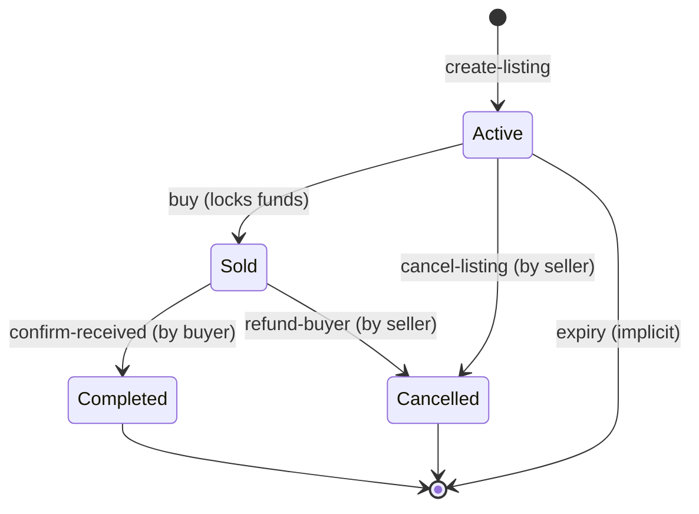

# Bob Market Architecture

**Bob Market** is a decentralized, reputation-based marketplace application built on the Stacks blockchain. It implements a trust-minimized escrow system with listing expiry and on-chain reputation tracking.

## 🏗 System Architecture

The application follows a standard dApp architecture:
- **Smart Contract Layer**: Clarity code running on Stacks L2, managing state and funds.
- **Frontend Layer**: React SPA interacting with the chain via Stacks.js.
- **Wallet Connection**: Authenticates users via Stacks Connect (e.g., Xverse, Leather).

### Smart Contract (`bob-market.clar`)

#### Storage Schema
The contract utilizes two primary data maps:

1.  **`listings`**: The core registry of items.
    ```clarity
    (define-map listings
      ((listing-id uint))
      ((seller principal)
       (price uint)
       (state uint)      ;; Enum: 0=Active, 1=Sold, 2=Completed, 3=Cancelled
       (buyer (optional principal))
       (metadata (optional (buff 256)))
       (expiry uint)))   ;; Block height
    ```

2.  **`reputation`**: Persistent seller scores.
    ```clarity
    (define-map reputation 
      ((user principal)) 
      ((score uint)))
    ```

#### State Machine
The listening state transitions follow a strict lifecycle enforced by the contract:



#### Error Codes
| Code | Description |
|------|-------------|
| `u100` | Price cannot be zero |
| `u101` | Listing ID already exists |
| `u102` | Unauthorized: Sender is not the seller |
| `u103` | Listing is not in `Active` state |
| `u104` | Listing not found |
| `u105` | Listing not active (cannot buy) |
| `u106` | Seller cannot buy their own listing |
| `u107` | Listing not `Sold` (cannot confirm) |
| `u108` | Unauthorized: Sender is not the buyer |
| `u110` | Listing not `Sold` (cannot refund) |
| `u112` | Expiry must be in the future |
| `u113` | Listing has expired |

---

## 💻 Frontend Architecture

The frontend is a **Single Page Application (SPA)** built for performance and type safety.

### Tech Stack
-   **Framework**: [Vite](https://vitejs.dev/) + [React](https://react.dev/) (TypeScript)
-   **Styling**: [Tailwind CSS](https://tailwindcss.com/) with a custom **Swiss Minimalist** design system (0px radius, high contrast).
-   **State Management**: 
    -   `@tanstack/react-query`: Caching chain data.
    -   `React Context`: Global state for Wallet session and Cart.
-   **Blockchain Interaction**: 
    -   `@stacks/network`: Network configuration (Mocknet/Testnet/Mainnet).
    -   `@stacks/connect`: Wallet authentication and transaction signing.

### Design System (Swiss Minimalist)
The UI enforces specific design tokens to achieve a "Gallery" aesthetic:
-   **Typography**: Large, bold, uppercase headings. System sans-serif fonts.
-   **Shape**: Strict 0px border-radius on all interactive elements.
-   **Color**: Monochrome (Black & White) with high-contrast borders. Shadows are disabled (`box-shadow: none`).

## 🛠 Development Setup

### Prerequisites
-   Node.js v18+
-   Clarinet (for local chain simulation)

### Installation
1.  **Install Dependencies**:
    ```bash
    npm install
    ```
2.  **Start Local Chain** (Terminal 1):
    ```bash
    clarinet integrate
    ```
3.  **Deploy Contracts**:
    The integrator will automatically deploy `bob-market.clar`. note the contract address.
4.  **Start Frontend** (Terminal 2):
    ```bash
    cd frontend
    npm run dev
    ```

### Testing
Run the Vitest suite backed by Clarinet SDK to verify contract logic:
```bash
npm test
```
